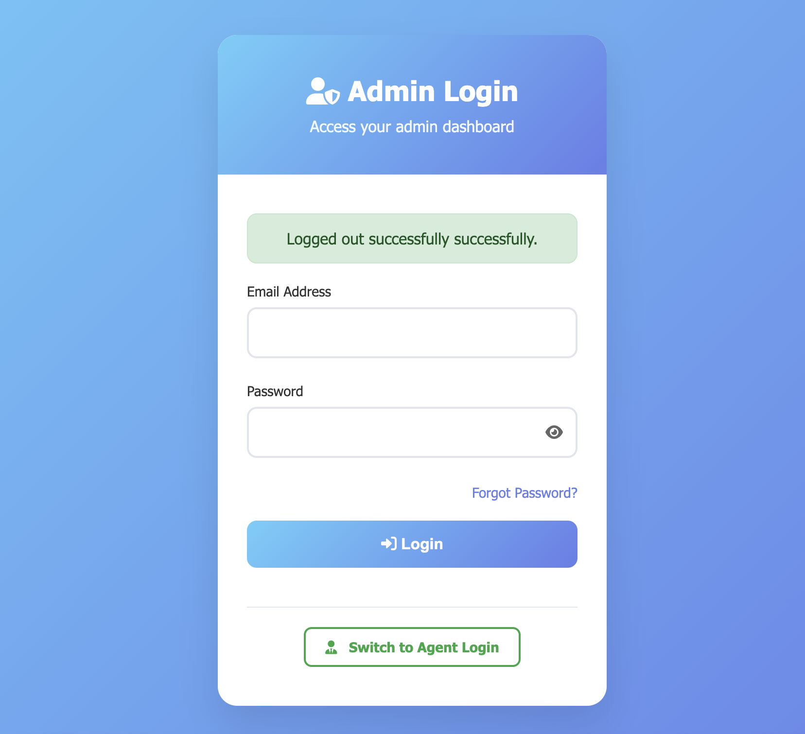
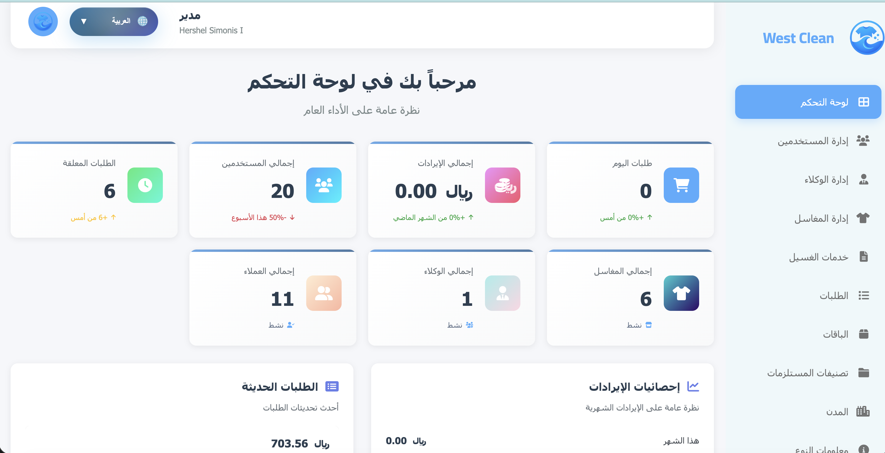
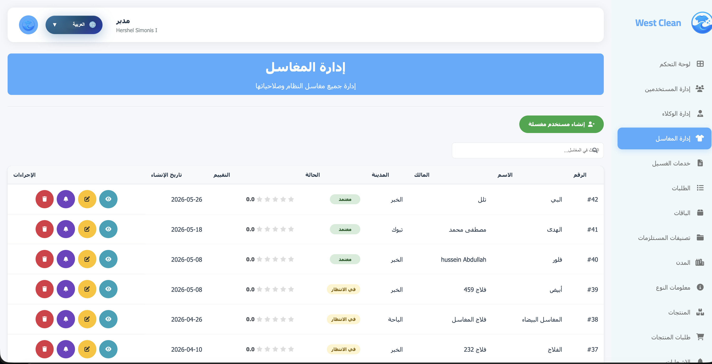
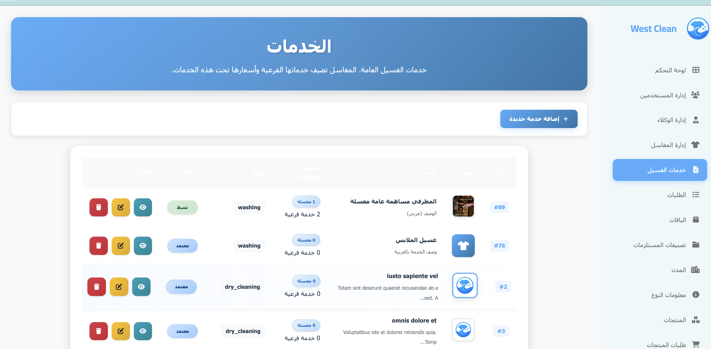
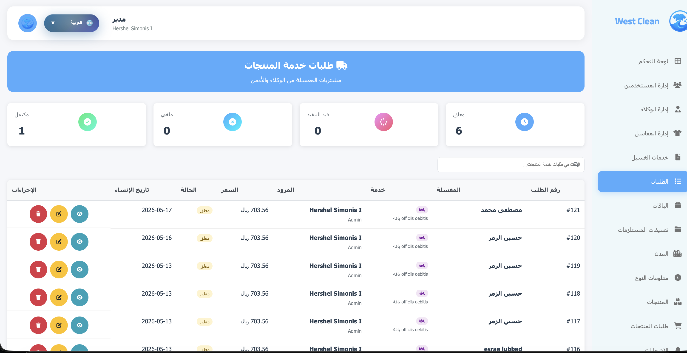
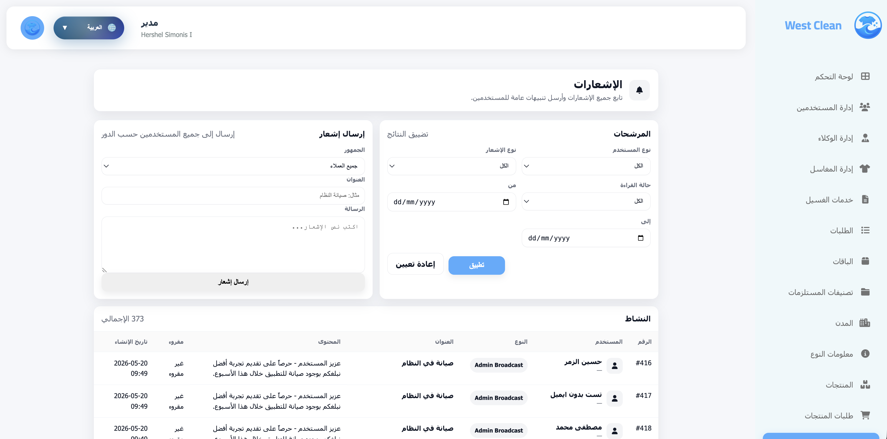
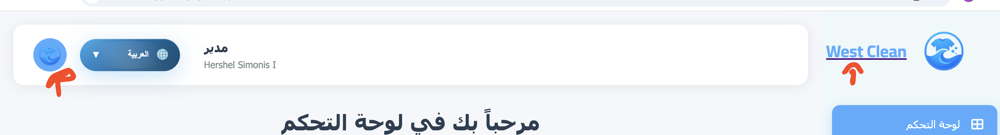

# WestClean (Laravel) – Laundry Marketplace API + Dashboards

Laravel backend for a laundry marketplace (Customer + Laundry apps) with an Admin dashboard.

This README is written to help reviewers (HR / engineers) quickly understand:
1) what the system does,
2) how the code is organized,
3) the key flows (mobile-first),
4) what to look at in the code.

---

## What This Project Does

**Roles**
- **Admin**: creates **Service Categories** (what the system offers) and manages packages, cities, supply products, approvals.
- **Laundry**: creates **SubServices** (the purchasable items) under admin categories and receives customer orders.
- **Customer**: browses services, selects a laundry, buys SubServices using coins; can also buy/gift coin packages.

**Core Concepts**
- `Service` = admin-managed **category** (no direct purchase).
- `SubService` = laundry-managed **purchasable item** (coin_cost + price + quantity + active).
- `Order` + `OrderItems` = purchases.
- `Package` = coin packs (online payment flow).

---

## Tech Stack

- Laravel 10
- PHP 8.1+ (compat fixes added for PHP 8.5 deprecations)
- MySQL
- Auth: Laravel Sanctum
- Localization: Arabic / English (Spatie translatable)
- Payment: Moyasar integration (callback verified server-side)

---

## Codebase Snapshot (Where Things Live)

Backend structure (high level):

```text
app/
  Http/
    Controllers/
      Api/                # Mobile API endpoints
      Web/                # Dashboard / landing page controllers
    Middleware/           # Role + locale middleware
  Models/                 # Eloquent models (Service, SubService, Order, Laundry, ...)
  Services/               # External integrations (e.g. Moyasar)
  Interfaces/             # Contracts (e.g. PaymentGatewayInterface)
  Helpers/                # Helper utilities (upload, assets, translations)
resources/
  views/                  # Blade templates (landing + dashboards)
  lang/                   # API + dashboard localization
routes/
  api.php                 # API routes (mobile)
  web.php                 # Dashboard + landing routes
tests/
  Feature/                # Feature tests
```

---

## Screenshots

Order:
1) Landing
2) Admin Login
3) Admin Dashboard
4) Laundry Management
5) Service Management
6) Orders Management
7) Notification Management














Extra:



---

## Mobile Flows (End-to-End)

### 1) Admin → Laundry → Customer (SubServices purchase flow)

1. **Admin** adds Service Categories (Dashboard)
2. **Laundry** uses categories list to create SubServices under a category
3. **Customer** browses categories, finds laundries that have active SubServices, then purchases

Mermaid flow:

```mermaid
flowchart LR
  A[Admin Dashboard] -->|Create Service Category| S[(services)]
  L[Laundry App] -->|GET /api/services| S
  L -->|POST /api/laundry/sub-services| SS[(sub_services)]
  C[Customer App] -->|GET /api/services| S
  C -->|GET /api/services/{serviceId}/laundries| LQ[Online Laundries With Active SubServices]
  C -->|GET /api/sub-services?service_id=..&laundry_id=..| SS
  C -->|POST /api/orders/purchase-service| O[(orders + order_items)]
```

### 2) Customer – Packages (buy / gift coins)

Endpoints:
- `POST /api/packages/purchase`
- `POST /api/packages/gift`

Important behavior:
- Prevent duplicate “in-progress” package purchases by auto-canceling previous pending/processing package orders before creating a new one.

---

## Key API Endpoints (Mobile)

### Public (no auth)
- `GET /api/services`  
  Admin-managed Service Categories list (approved/active only).

- `GET /api/services/{serviceId}/laundries?city_id=...`  
  Online laundries that have **active SubServices** under the selected service.

- `GET /api/sub-services?service_id=...&laundry_id=...&active_only=1`  
  Purchasable SubServices for a laundry within a selected service.

### Auth (Sanctum)
- Auth:
  - `POST /api/auth/register`
  - `POST /api/auth/login`
  - `POST /api/auth/send-otp`
  - `POST /api/auth/verify-otp`

- Customer:
  - `GET /api/customer/profile`
  - `GET /api/customer/orders`
  - `GET /api/customer/wallet`

- Orders:
  - `POST /api/orders/purchase-service`

- Laundry (role=laundry):
  - `GET /api/laundry/services` (my categories with my SubServices)
  - `GET /api/laundry/sub-services` (my SubServices only, auth-based)
  - `POST /api/laundry/sub-services` (create)
  - `PUT /api/laundry/sub-services/{id}` (update)
  - `DELETE /api/laundry/sub-services/{id}` (delete)
  - `GET /api/laundry/orders` (my customer orders)
  - `GET /api/laundry/supply-orders` (my supply orders)

Payment (important, do not remove):
- `POST /api/payment/process`
- `GET|POST /api/payment/callback`

---

## Security Notes (What To Look For)

- Sanctum token auth for mobile.
- Role-based access control (e.g. `role:laundry` routes).
- Payment callback is verified server-side (never trust callback status alone).
- Image upload validation + fail-fast behavior for SubServices.

---

## Local Development (Quick Start)

```bash
composer install
cp .env.example .env
php artisan key:generate
php artisan migrate
php artisan serve
```

---

## Tests

```bash
php artisan test
```

Note: Your local DB / environment settings may affect test execution.

---

## What HR / Reviewers Usually Check

- Clear domain boundaries: Service categories vs SubServices.
- Correct auth + authorization (laundry endpoints scoped to authenticated laundry only).
- Payment reliability + idempotency.
- Clean API responses for mobile consumption.
- Practical performance: caching + avoiding heavy frontend animations.
